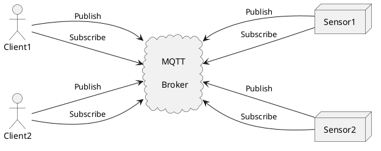
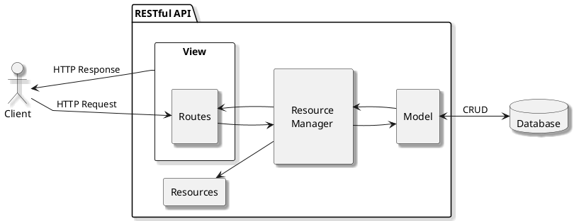
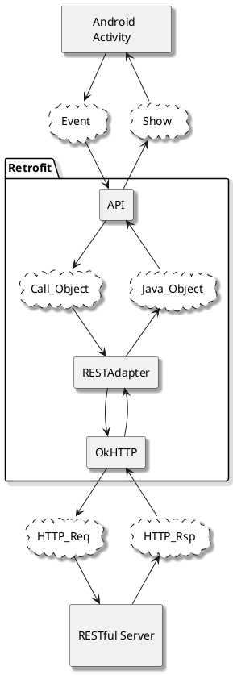
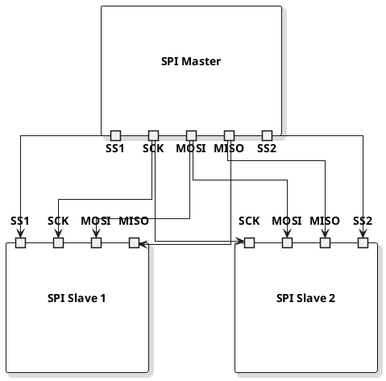
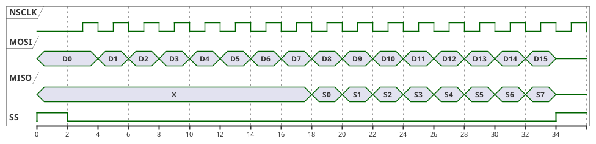

# MQTT Architecture diagram

```plantuml
@startuml MQTT
left to right direction
actor Client1
actor Client2

Cloud Broker [

    MQTT    

    Broker  

]
node Senzor1 [
    Sensor1
]
node Senzor2 [
    Sensor2
]

Client1 ---> Broker: Publish
Client1 ---> Broker: Subscribe
Client2 ---> Broker: Publish
Client2 ---> Broker: Subscribe

Broker <--- Senzor1: Publish
Broker <--- Senzor1: Subscribe
Broker <--- Senzor2: Publish
Broker <--- Senzor2: Subscribe

@enduml
```

# RESTful structure

```plantuml
@startuml RESTful
skinparam linetype polyline
skinparam shadowing true 
left to right direction
actor Client
database "Database" as db
package "RESTful API" as rest {
    rectangle View {
        rectangle Routes [
            
            Routes

        ]   
    }
    rectangle Resources [
        

            Resource
            Manager     


    ]
    rectangle "Resources" as res
    rectangle Model [
        
        Model

    ]

    Client --> Routes : "HTTP Request"
    Routes --> Resources
    Resources --> Model
    Resources <-- Model
    Routes <-- Resources
    Model <--> db : "CRUD"
    Client <-- View : "HTTP Response"
    res <-- Resources
}
@enduml
```

# Retrofit REST API Client

```plantuml
@startuml
skinparam linetype polyline
skinparam shadowing true 

rectangle "\tAndroid\t\n\tActivity\t\t" as activity
package Retrofit as retrofit {
    cloud Call_Object as c1 #white;line.dashed
    cloud Java_Object as javaobj #white;line.dashed
    rectangle API as api
    rectangle RESTAdapter as restadapter
    rectangle OkHTTP as okhttp
    api --> c1
    c1 --> restadapter
    api <-- javaobj
    javaobj <-- restadapter
    
    restadapter --> okhttp
    restadapter <-- okhttp
}
rectangle "\nRESTful Server\n" as server
cloud Event #white;line.dashed
cloud Show #white;line.dashed
cloud HTTP_Req as HTTPReq #white;line.dashed
cloud HTTP_Rsp as HTTPRsp #white;line.dashed
activity --> Event
Event --> api
activity <-- Show
Show <-- api
okhttp --> HTTPReq
HTTPReq --> server
HTTPRsp <-- server
okhttp <-- HTTPRsp
@enduml
```

# SPI Master and Multiple Slaves

```plantuml
@startuml
skinparam linetype ortho
skinparam shadowing true
top to bottom direction

rectangle master as "\n\n\nSPI Master" {
    portout m2 as "<b>SCK"
    portout m3 as "<b>MOSI"
    portout m4 as "<b>MISO"
    portout m1 as "<b>SS2"
    portout m0 as "<b>SS1"
}
rectangle slave1 as "\n\n\nSPI Slave 1" {
    portin s1 as "<b>SS1"
    portin s2 as "<b>SCK"
    portin s3 as "<b>MOSI"
    portin s4 as "<b>MISO"
}

rectangle slave2 as "\n\n\nSPI Slave 2" {
    portin ss4 as "<b>MISO"
    portin ss1 as "<b>SS2"
    portin ss2 as "<b>SCK"
    portin ss3 as "<b>MOSI"
}

m0 ---> s1
m1 ---> ss1

m2 ---> s2 
m3 ---> s3 
m4 ---> s4

m2 ---> ss2
m3 ---> ss3
m4 ---> ss4
@enduml
```

# SPI Time diagram

```plantuml
@startuml
clock "NSCLK" as sclk with period 2 pulse 1 offset 3 
concise "MOSI" as mosi
concise "MISO" as miso
binary "SS" as ss

@0
ss is high
mosi is D0
miso is X

@2
ss is low

@4
mosi is D1

@6
mosi is D2

@8
mosi is D3

@10
mosi is D4

@12
mosi is D5

@14
mosi is D6

@16
mosi is D7

@18
mosi is D8
miso is S0
@20
mosi is D9
miso is S1
@22
mosi is D10
miso is S2
@24
mosi is D11
miso is S3
@26
mosi is D12
miso is S4
@28
mosi is D13
miso is S5
@30
mosi is D14
miso is S6
@32
mosi is D15
miso is S7
@34
mosi is {-}
miso is {-}
ss is high

@enduml
```