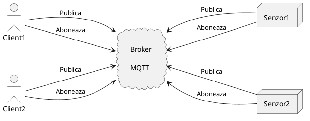
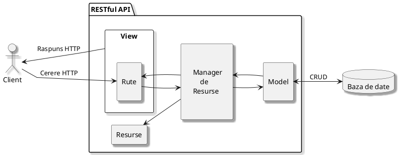
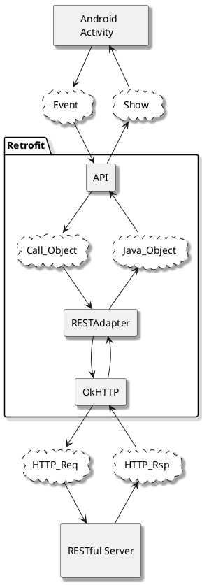
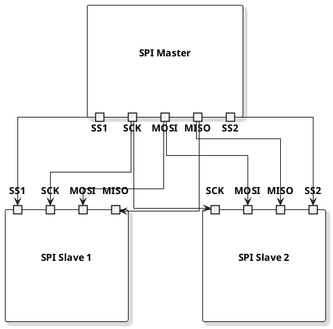
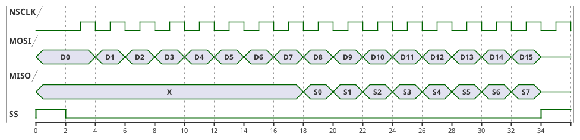
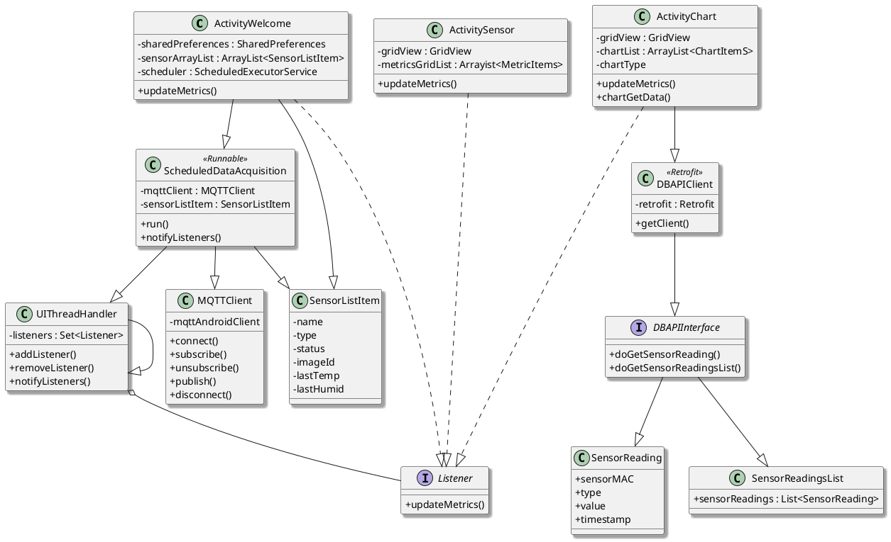

# MQTT Architecture diagram



# RESTful structure



# Retrofit REST API Client


# SPI Master and Multiple Slaves


# SPI Time diagram


# Application general scheme
```plantuml
@startuml
skinparam shadowing true
left to right direction
!$ICONURL = "https://raw.githubusercontent.com/tupadr3/plantuml-icon-font-sprites/v3.0.0/icons"
!include $ICONURL/common.puml
!include $ICONURL/font-awesome-6/mobile_screen_button.puml
FA6_MOBILE_SCREEN_BUTTON(android, "Telefon\n  Mobil")
rectangle mqtt as "\nBroker MQTT\n"
!$ICONURL = "https://raw.githubusercontent.com/tupadr3/plantuml-icon-font-sprites/v3.0.0/icons"
!include $ICONURL/common.puml
!include $ICONURL/font-awesome-5/server.puml
FA5_SERVER(server, "Server\nRESTful")
database mongodb as "\nBaza de date\n   MongoDB\n"
rectangle house as " " {
collections sensor as "\nSenzori\n"
!$ICONURL = "https://raw.githubusercontent.com/tupadr3/plantuml-icon-font-sprites/v3.0.0/icons"
!include $ICONURL/common.puml
!include $ICONURL/material/router.puml
MATERIAL_ROUTER(router, Router)
}

android --> mqtt  
android <-- mqtt : MQTT
android --> server
android <-- server : HTTP
mqtt --> server
mqtt <-- server : HTTP
server --> mongodb
server <-- mongodb : "TCP/IP\nSockets"
mqtt ---> router
mqtt <--- router : MQTT
router --> sensor : Wi-Fi
router <-- sensor


@enduml
```

# Application general scheme


# Flask Project Structure
```
	|-monitoring_system_bknd/
		|-src/
			|-__init__.py
			|-sensor_data_controller.py
            |-sensor_data_model.py
            |-sensor_data_routes.py
            |-sensor_data_view.py
		|-venv/
		|-.env
		|-requirements.txt
		|-run.py
```

# JSON data format from MQTT Broker to Android
{  
  "Temperature" : 29.468,  
  "Humidity" : 59.301,  
  "PM1.0" : 30.597,  
  "PM2.5" : 32.356,  
  "PM4.0" : 32.356,  
  "PM10.0" : 32.356,   
  "TPS" : 446,  
  "VOCIndex" : 316  
}  

# JSON data format from RESTful Server to Android
{  
    "list": [  
        {  
            "sensorMAC": "F8F005ADB2A9",  
            "type": "airQ1",  
            "Temperature": 30.002,  
            "Humidity": 56.854,  
            "PM1.0": 29.595,  
            "PM2.5": 31.382,  
            "PM4.0": 31.455,  
            "PM10.0": 31.49,  
            "TPS": 457.0,  
            "VOCIndex": 142.0,  
            "timestamp": "2024-08-16T16:50:52.880000Z"  
        },  
        {  
            "sensorMAC": "F8F005ADB2A9",  
            "type": "airQ1",  
            "Temperature": 30.022,  
            "Humidity": 56.854,  
            "PM1.0": 30.336,  
            "PM2.5": 32.08,  
            "PM4.0": 32.081,  
            "PM10.0": 32.082,  
            "TPS": 452.0,  
            "VOCIndex": 141.0,  
            "timestamp": "2024-08-16T16:51:12.227000Z"  
        }  
	]  
}  

 # MQTT Broker internal architecture

 ```plantuml
@startuml
skinparam shadowing true
left to right direction
rectangle mosquitto [
    MQTT Broker
    Mosquitto
]
rectangle subscriber [
    \tWildcard
    MQTT   Subscriber
]

mosquitto --> subscriber: Every publish
mosquitto <-- subscriber: Subscribe for #

@enduml
```

# PI MongoDB Document Example 
sensorReadings> db.readings.findOne({})  
{  
  timestamp: ISODate('2024-08-16T13:28:41.849Z'),  
  metadata: { sensorMAC: 'F8F005ADB2A9', type: 'airQ1' },  
  'PM2.5': 19.96,  
  _id: ObjectId('66bf5409878dda90726c34a2'),  
  'PM1.0': 18.875,  
  VOCIndex: 100,  
  TPS: 418,  
  'PM4.0': 19.96,  
  Humidity: 56.689,  
  Temperature: 29.75,  
  'PM10.0': 19.96  
}  

# PI - Sensor Unit Diagram

 ```plantuml
@startuml
skinparam shadowing true
left to right direction
skinparam linetype poli

component artyz7 as "Arty Z7" {
    !$ICONURL = "https://raw.githubusercontent.com/tupadr3/plantuml-icon-font-sprites/v3.0.0/icons"
    !include $ICONURL/common.puml
    !include $ICONURL/font-awesome-6/microchip.puml
    FA6_MICROCHIP(zynq7000, "Zynq 7000")
    
}
component wincxpro as "WINC1500-XPRO" {
    !$ICONURL = "https://raw.githubusercontent.com/tupadr3/plantuml-icon-font-sprites/v3.0.0/icons"
    !include $ICONURL/common.puml
    !include $ICONURL/font-awesome-6/wifi.puml
    FA6_WIFI(atwinc1500, ATWINC1500)
}

component hygro as "Pmod HYGRO" {
    !$ICONURL = "https://raw.githubusercontent.com/tupadr3/plantuml-icon-font-sprites/v3.0.0/icons"
    !include $ICONURL/common.puml
    !include $ICONURL/font-awesome-6/temperature_high.puml
    FA6_TEMPERATURE_HIGH(hdc1080, HDC1080)
}

component sgp40 as "VOCSensor" {
    rectangle voc as "SPS40"
}

component sps30 as "ParticulateMatterS" {
    !$ICONURL = "https://raw.githubusercontent.com/tupadr3/plantuml-icon-font-sprites/v3.0.0/icons"
    !include $ICONURL/common.puml
    !include $ICONURL/material/blur_on.puml
    MATERIAL_BLUR_ON(_sps30, SPS30)
}

wincxpro <---> artyz7 : SPI
wincxpro <--- artyz7 : RESET_N
wincxpro ---> artyz7 : IRQ
artyz7 <--> hygro : I2C
artyz7 <--> sps30 : I2C
hygro <--> sgp40 : I2C


@enduml
```

# PI - Main State Machine
 ```plantuml
@startuml
skinparam shadowing true
skinparam ConditionEndStyle diamond
:Initialize all peripherals;
repeat :Search for AP information in memory;
if (Have saved AP info?) then (Yes)
    :Connect to router;
    :Initialize MQTT module;
    :Connect Socket;
    :Connect to MQTT Broker; 
    :Subscribe for Alarms;
    repeat
        if (Queue Empty?) then (No)
            :Prepare packet;
            :Send MQTT Publish;
        elseif (Publish time?) then (No)
        elseif (Data ready?) then (Yes)
            :Enqueue MQTT publish;
            :Compute Next publish;
        else
            :Start Acq;
        endif
    repeat while (Lost Router Connection?) is (No) not (Yes)
else (No)
    :Enter AP Mode;
    :Wait user connection;
    :Listen for Socket Conn;
    :Exchange router info;    
    :Save router info;
    :Close AP Mode;
endif
repeat while

@enduml
```